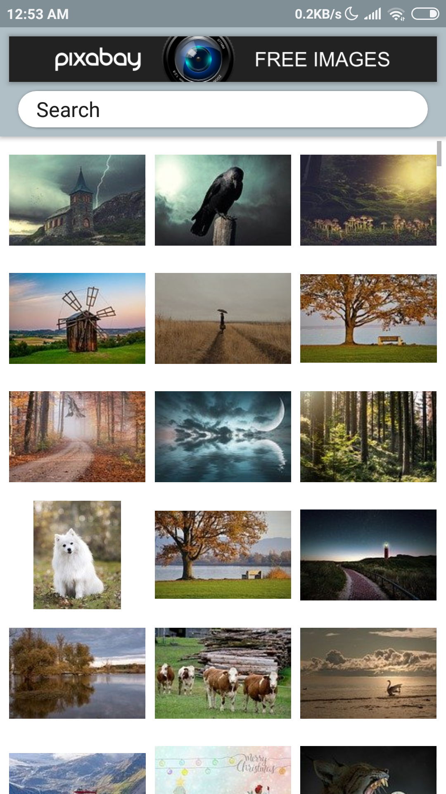
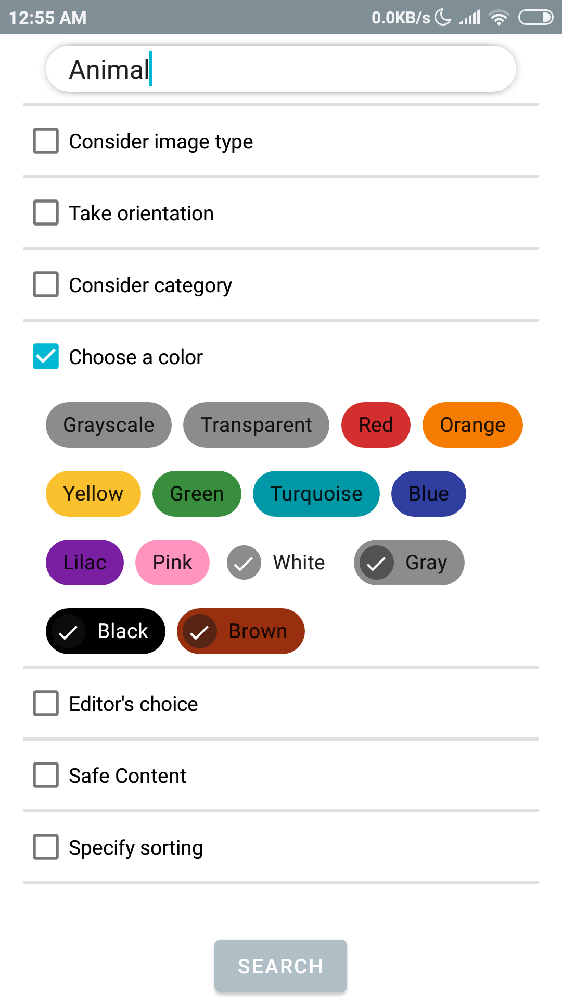
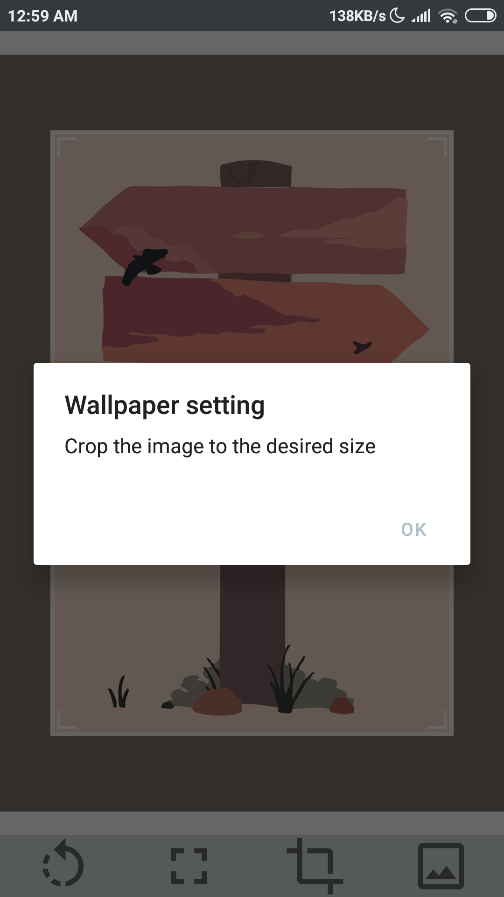
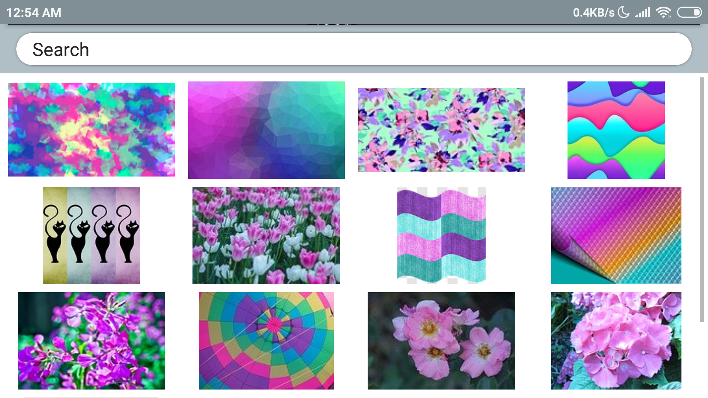

Приложение позволяет просматривать более двух миллионов бесплатных изображений с популярного ресурса pixabay.com. Можно найти именно те изображения, которые вам нужны. Для этого используется настраиваемый поиск. Понравившееся изображение можно увеличить. Приложение позволяет скачать изображение, установить обои и поделиться с друзьями.

---

##### Приложение опубликовано в GooglePlay

---
##### Основные программные решения:
- minSdkVersion 21
- Язык прогрммирования - *Java*
- Архитектура - *MVVM* (ViewModel, LiveData)
- Single activity
- Использование библиотек:
  + Dagger2 - внедрение зависимостей
  + RxJava2 - асинхронное выполнение операций
  + PagingLabrary - постраничная загрузка данных
  + Retrofit2, Gson - работа с веб-сервером
  + Picasso - работа с изображениями
  + Room - кэширование в базу данных
  + ViewPager - поочередный показ изображений
  + и другие

---

##### Основные возможности:

- Показ галереи изображений согласно условиям поиска
- Пагинация при загрузке изображений
- Загрузка и сохранение данных в кэш
- Сохранение загруженных данных при уходе приложения в фон
- Повороты экрана
- Обработка ошибочных ситуаций при отсутствии интернета, возможность повторной загрузки данных
- Удобный инфтерфейс для задания параметров поиска
- Сохрнение параметров поиска для следующего запуска приложения
- Поочередный(в режиме пэйджера) просмотр изображений
- Масштабирование изображения при просмотре
- Сохранение изображения на внешний накопитель
- Возомжность поделиться изображением с использованием других доступных приложений
- Редактирование изображения (повороты, обрезка, установка пропорций под экран) для установки обоев
- Установка изображения в качестве обоев
---
##### Скриншоты

---

---

---

---

---
